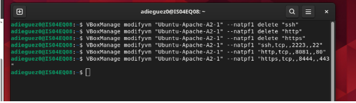
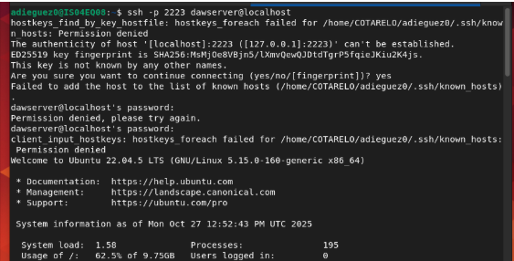
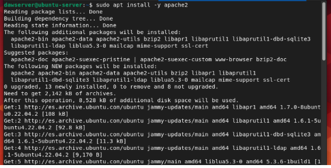
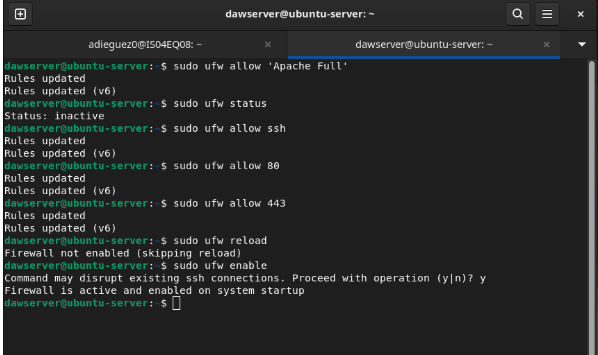
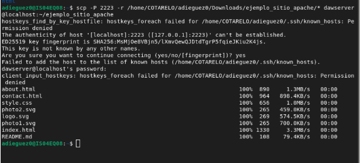
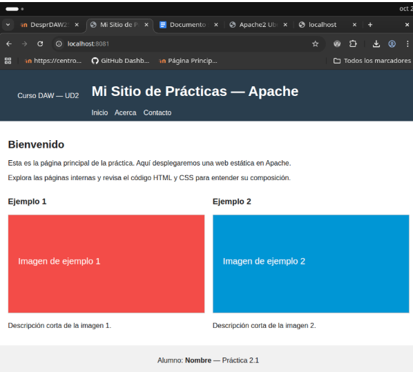

# despr2_1_apache
Instalación y despliegue básico con Apache

## Tareas Paso a Paso 
Creacion de la VM

Configura la red

Inicia la VM por SSH desde el Host

## Preparación del entorno
Actualiza los Paquetes

Instala apache2

Configura el firewall para permitir tráfico HTTP y HTTPS:
Verifica que las reglas se han aplicado:
Si no está configurado, habilita el tráfico ssh, HTTP y HTTPS
Habilita el firewall si no está habilitado

### Comprobación básica
Comprueba que el servicio está activo

Desde el host, accede a http://localhost:8081/ y comprueba que ves la página por defecto de Apache

### Desplegar el sitio de ejemplo
Copia los archivos del sitio de ejemplo a /var/www/html/
Utiliza scp desde tu máquina local:

En la VM crear la estructura de carpetas
Ajustar los permisos y propiedad de los archivos para que Apache
pueda servirlos correctamente:
:

### Comprobar
